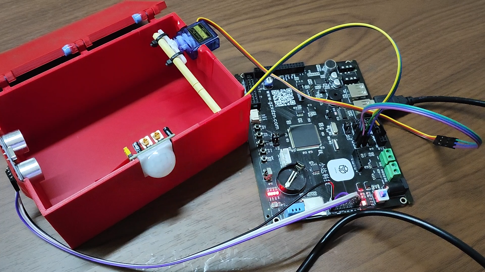
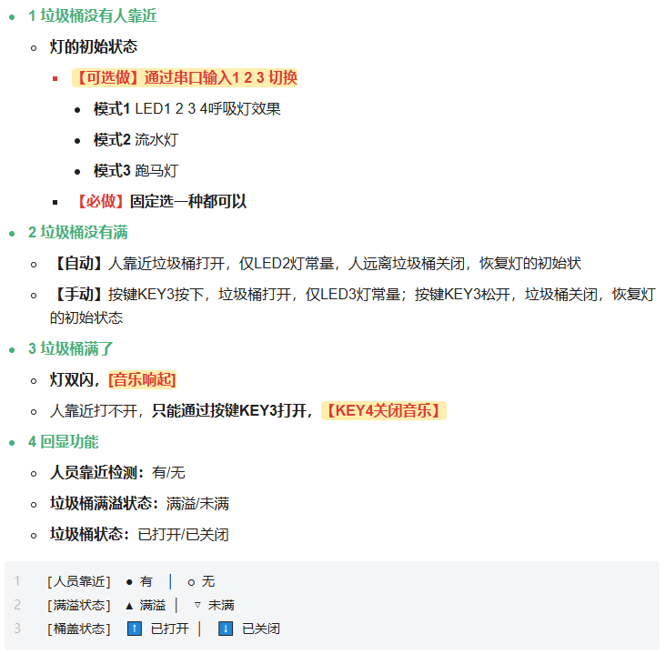
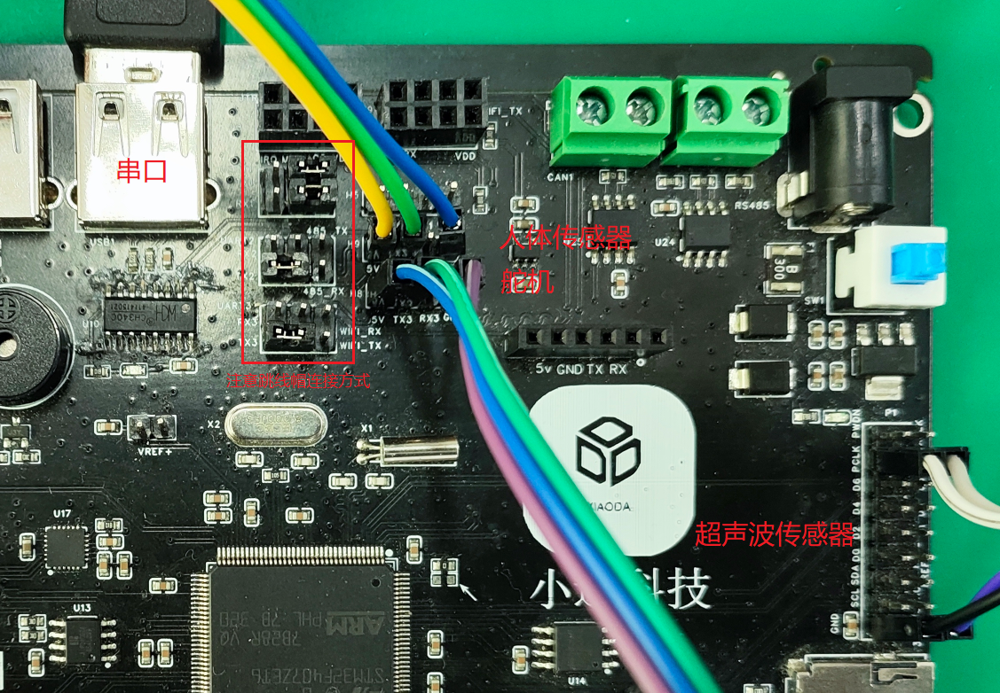
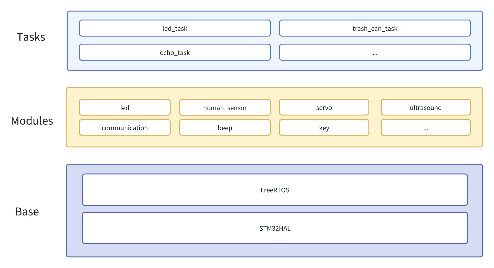
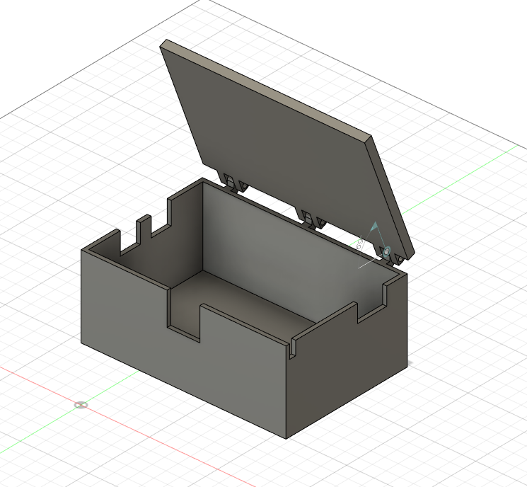

  <h1>Smart_Trash_Can</h1>
  
本项目是沈航电子信息工程学院2025年校企联合专业工程实训结课项目

# 题目需求

# 硬件选型

所有硬件均为教师指定。

- 开发板：小达科技STM32F407ZET6
- 人体传感器：HC-SR501
- 舵机：SG90
- 超声波传感器：HC-SR04

# 硬件连线

人体传感器及舵机需要5V供电，超声波可使用3.3V或5V供电。

# 开发环境

- STM32CUBEMX 6.9.2

- Keil uVision5 5.38

- Visual Studio Code 1.100.2

  - 扩展 Keil Assistant 1.7.0

- Ozone V3.30a

  vscode为代码编辑环境，可选。Ozone为调试环境，可选。

# 软件架构

# 3D打印图纸

# 注意事项

人体传感器灵敏度感人，即使调整了电位器也容易出现误识别或不识别

# 其它

开发板高清图

 [开发板原理图](.doc\M4核心板v1.2.pdf)
